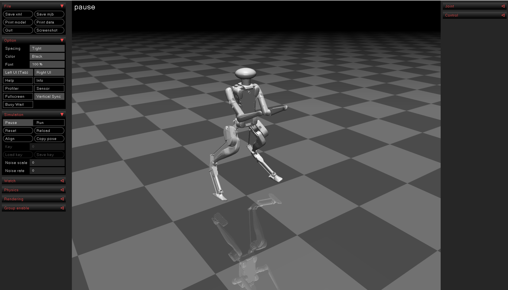

# Digit MuJoCo ROS2

<div align="center">
    
</div>

## Introduction

This package is developed with [ROS2](https://docs.ros.org/en/humble/index.html) based on [Digit-V3_SDF_Model](https://github.com/yu-fz/Digit-V3_SDF_Model).

The files include:

1. The XML file `(description/model/xml/digit.xml)` of [Digit](https://agilityrobotics.com/news/2022/future-robotics-l3mjh) for the simulation in [MuJoCo](https://mujoco.org/).
2. A class named `MuJoCoMessageHandler` is also provided, which publishes the robot joint state and imu message. The `odom` message is just the real pose of the robot in simulation. More details can be found in the cpp file `simulation/mujoco/src/MuJoCoMessageHandler.cpp`.
3. ROS2 ([version](https://docs.ros.org/en/humble/index.html)) is needed to run this package.

## Installation

```
# Create your own workspace
cd ~/ & mkdir -p your_workspace/src
```

```
# Clone this package to your_workspace/src
cd ~/your_workspace/src & git clone https://github.com/DeepBreakOfficial/Digit-MuJoCo-ROS2.git
```

```
# Build (DO NOT remove `--symlink-install`)
colcon build --symlink-install 
```

```
# Setup env
source ../install/setup.bash
```

```
# Run simulation 
ros2 launch mujoco simulation_launch.py
```

Now your can open a new terminal and use command `ros2 topic list` to see the below topics
```
/parameter_events
/rosout
/simulation/actuators_cmds
/simulation/imu_data
/simulation/joint_states
/simulation/odom

```

# Copyright
Permission to repackage and re-distribute software from Agility Robotics hereby granted under:
```
Copyright (c) Agility Robotics

Permission is hereby granted, free of charge, to any person obtaining a copy
of this software and associated documentation files (the "Software"), to
deal in the Software without restriction, including without limitation the
rights to use, copy, modify, merge, publish, distribute, sublicense, and/or
sell copies of the Software, and to permit persons to whom the Software is
furnished to do so, subject to the following conditions:

The above copyright notice and this permission notice shall be included in
all copies or substantial portions of the Software.

THE SOFTWARE IS PROVIDED "AS IS", WITHOUT WARRANTY OF ANY KIND, EXPRESS OR
IMPLIED, INCLUDING BUT NOT LIMITED TO THE WARRANTIES OF MERCHANTABILITY,
FITNESS FOR A PARTICULAR PURPOSE AND NONINFRINGEMENT. IN NO EVENT SHALL THE
AUTHORS OR COPYRIGHT HOLDERS BE LIABLE FOR ANY CLAIM, DAMAGES OR OTHER
LIABILITY, WHETHER IN AN ACTION OF CONTRACT, TORT OR OTHERWISE, ARISING
FROM, OUT OF OR IN CONNECTION WITH THE SOFTWARE OR THE USE OR OTHER DEALINGS
IN THE SOFTWARE.
```
